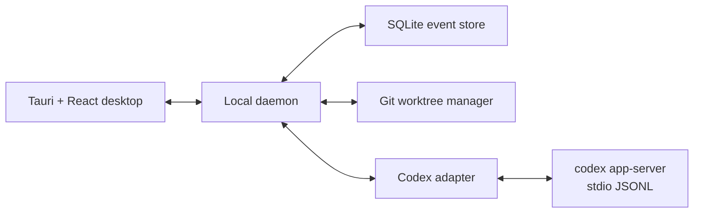

# Open Codex

An unofficial, local-first, open source desktop control plane for the
[OpenAI Codex CLI](https://github.com/openai/codex).

Open Codex does not reimplement the coding agent. It launches the open-source
`codex app-server`, translates its versioned JSON-RPC stream into a stable
application model, and adds the product layer needed for safe parallel work:
projects, tasks, approvals, diffs, worktrees, recovery, and audit history.

> Status: architecture baseline and runnable vertical slice. Not ready for
> production use.

## Why this architecture

Codex already provides the hard runtime capabilities:

- thread, turn, and item lifecycle;
- streaming messages, commands, file changes, and tool calls;
- sandbox and approval enforcement;
- authentication, models, configuration, MCP, skills, and apps;
- session resume, fork, archive, rollback, and review;
- version-matched TypeScript and JSON Schema generation.

Open Codex owns the GUI and control-plane concerns instead of forking the agent
loop. The boundary is the documented `codex app-server` protocol.



SQLite and worktree orchestration are specified but not yet implemented in the
current vertical slice.

## Current vertical slice

- Detect and launch a locally installed Codex CLI.
- Perform the required `initialize` / `initialized` handshake.
- Create a thread for a local project.
- Start a text turn and stream assistant output.
- Display command and file-change items.
- Show command/file approval requests and return a decision.
- Keep unknown upstream notifications observable for forward compatibility.
- Generate protocol bindings from the installed Codex version.

## Quick start

Requirements: Node.js 22+, pnpm 6+, and an authenticated Codex CLI.

```bash
pnpm install
pnpm schema:codex
pnpm smoke:codex
pnpm dev
```

Open `http://127.0.0.1:1420`. The daemon listens only on
`127.0.0.1:4737`.

For the Tauri development shell:

```bash
pnpm --filter @open-codex/desktop tauri dev
```

## Documentation

- [Product and technical specification](docs/SPEC.md)
- [Architecture](docs/ARCHITECTURE.md)
- [Delivery roadmap](docs/ROADMAP.md)
- [Reproduction guide](docs/REPRODUCTION.md)
- [Upstream compatibility policy](docs/UPSTREAM_COMPATIBILITY.md)
- [Architecture decision records](docs/adr/0001-codex-app-server.md)

## Non-goals

- Copying the proprietary Codex desktop, web, or IDE user interface.
- Reimplementing the Codex agent loop in the first release.
- Bypassing OpenAI authentication, subscription, policy, or rate limits.
- Exposing app-server directly to a public network.
- Claiming affiliation with OpenAI.

## License and naming

Open Codex is licensed under Apache-2.0. It is independent and unofficial.
OpenAI, ChatGPT, and Codex may be trademarks of OpenAI. The project name is a
working name and should receive a trademark review before broad distribution.
