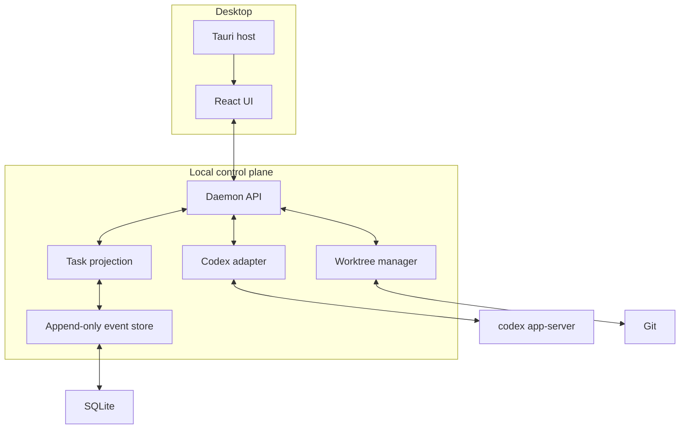

# Architecture

## Context

Open Codex is a client and control plane around a separately versioned agent
runtime. The architecture must preserve Codex fidelity while protecting the UI
and database from upstream protocol churn.

## Runtime view



## Ownership rules

- UI owns presentation and transient input state.
- Daemon owns all side effects and durable state.
- Codex owns agent conversation, model execution, sandboxing, and approvals.
- Open Codex owns task/workspace identity, Git orchestration, and projections.
- Git is the source of truth for repository and patch state.
- SQLite is the source of truth for Open Codex metadata and event history.

## Codex connection lifecycle

1. Resolve configured binary path.
2. Run `codex --version`.
3. Check version support policy.
4. Spawn `codex app-server --listen stdio://`.
5. Send one `initialize` request.
6. Send `initialized` notification after success.
7. Read stdout one JSON object per line.
8. Keep stderr as runtime diagnostics, never protocol.
9. Route responses by request id.
10. Persist and display server-initiated requests.
11. On exit, fail pending calls and mark sessions disconnected.
12. Reconnect, read/resume known threads, and reconcile task state.

## Adapter boundary

The adapter exposes domain operations:

```ts
interface AgentAdapter {
  connect(): Promise<RuntimeInfo>;
  startSession(input: StartSession): Promise<SessionRef>;
  resumeSession(ref: SessionRef): Promise<SessionSnapshot>;
  startTurn(input: StartTurn): Promise<TurnRef>;
  interruptTurn(ref: TurnRef): Promise<void>;
  resolveRequest(input: ResolveRequest): Promise<void>;
  events(): AsyncIterable<AgentEvent>;
}
```

No React component imports generated Codex protocol types. Generated types are
used inside the adapter and contract tests.

## Daemon API

The current alpha uses loopback WebSocket messages. The production API will:

- authenticate each UI connection with an ephemeral capability;
- use command ids for idempotency;
- replay events from a cursor after reconnect;
- bound queues and report backpressure;
- reject non-loopback origins;
- version the Open Codex envelope independently of Codex.

## Persistence

The implementation will use an append-only event table plus relational
projections. A transaction first appends the event, then updates the relevant
projection. On startup, projections can be checked or rebuilt.

Large command output and artifacts are content-addressed files outside SQLite.
The database stores hashes, metadata, and paths.

## Failure handling

| Failure              | Required response                                     |
| -------------------- | ----------------------------------------------------- |
| Codex binary missing | Explain resolution paths; do not start daemon loop    |
| Unsupported protocol | Block turns; offer schema diagnostics                 |
| Invalid JSON line    | Log redacted line metadata; continue below threshold  |
| App-server exit      | Fail pending RPCs; retain task; offer reconnect       |
| UI disconnect        | Keep task running; preserve approvals as pending      |
| Daemon crash         | WAL recovery; reconcile runtime and Git               |
| Worktree mismatch    | Mark workspace `corrupt`; require user resolution     |
| Disk full            | Interrupt writes where possible; preserve diagnostics |
| Unknown approval     | Generic safe UI; never auto-approve                   |

## Packaging direction

During development, Node hosts the daemon. Before public beta, choose between:

1. bundle a Node runtime and daemon as a Tauri sidecar; or
2. move daemon ownership to Rust while retaining TypeScript protocol packages.

The decision is based on installer size, process reliability, PTY behavior, and
cross-platform support, not language preference.
